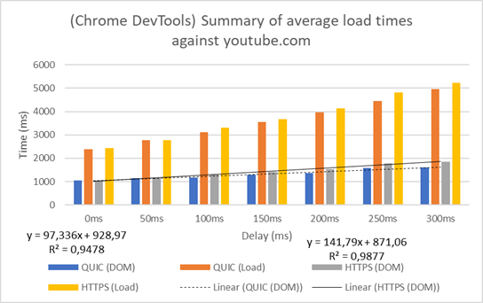
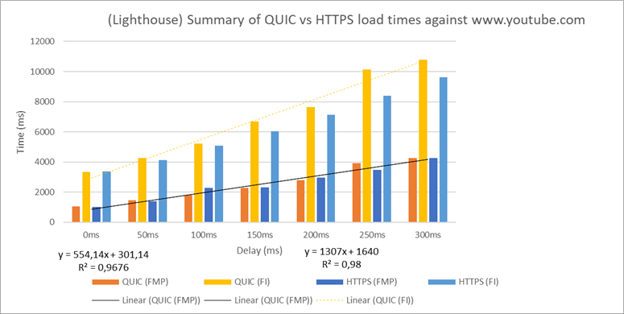
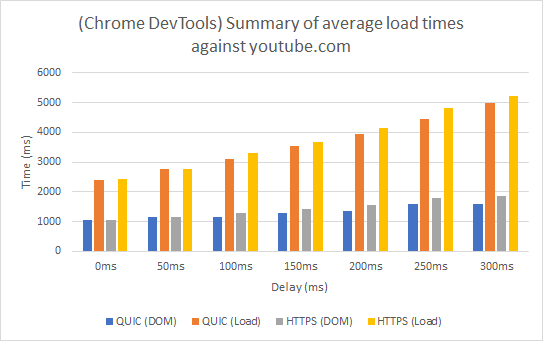
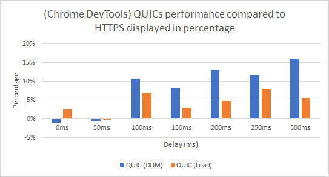
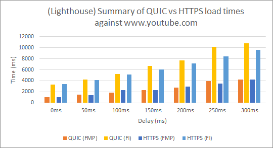
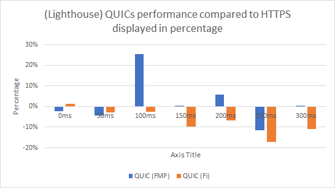

# QUIC-vs-HTTPS-performance
This is an assignment that compares QUIC (and HTTP) vs the HTTPS stack (TCP+TLS+HTTP) in a rather unorthodox manor. It does not make use of the QUIC client and server, but instead attempts to use live websites (e.g youtube.com) that has QUIC and HTTPS enabled.

This examination uses the Lighthouse tool and the Google Devloper Tool in order to take measurements, each measurement has been measured ten times, and an average calculation is used in order to reduce the impact of singular (strange) metrics. You can read more about this in papers, that might be linked here after they have been approved. :)

### Papers approved
**First paper:** [QUIC an insight of the protocol](https://www.kth.se/files/view/matslova/5ae109ab6000a5039743ef93/quic_an_insight_of_the_protoco.pdf)

**Second paper:** [QUIC vs HTTPS stack comparasion](https://www.kth.se/files/view/matslova/5ae109846000a5039743ef92/quic_vs_tcp_performance.pdf)

## Additional calculations

## Baseline result

